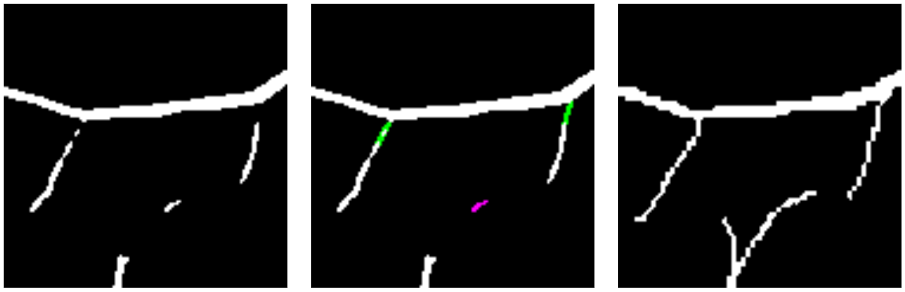
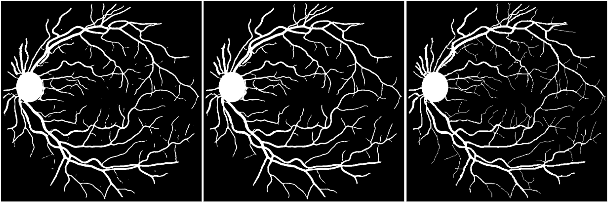

### Supplementary Material for: 
# "Ensuring a connected structure for Retinal Vessels Deep-Learning Segmentation"

<strong>VNR (Vessels Network Retrieval)</strong> pipeline generates a fully connected retinal vessels structure.  
As describe in the [ARTICLE](images/Article.pdf) and in the [POSTER](images/Poster.pdf), VNR comes with two main algorithms: 

---
The [gapFilling](gapFilling.py) algorithm, reconnecting endpoints to endpoints, closing small gaps.

---
The [rebranchOrRemove](rebranchOrRemove.py) algorithm, reconnecting endpoints to non-endpoints, and removing artifacts. 

---
The use of VNR assumes high-quality optic disk and vessels segmentations (dice $\geq$ 0.8) to obtain good reconnection performances.

